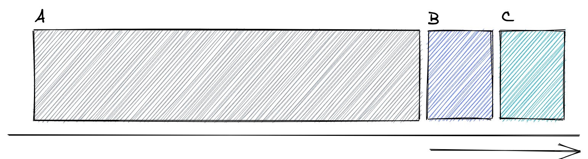
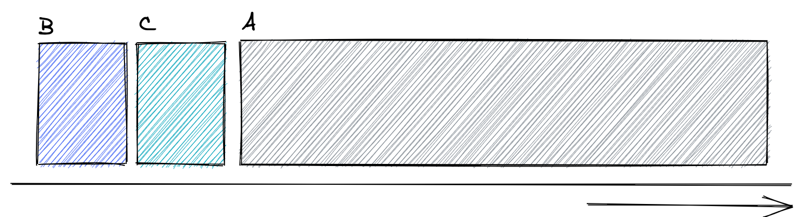
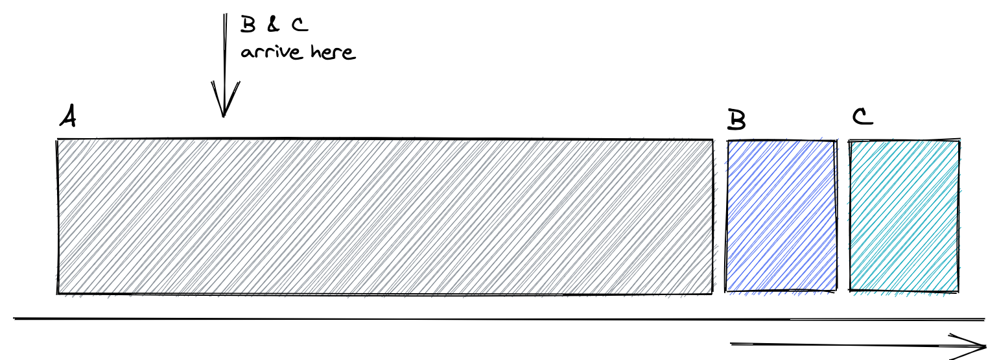

# Ch. 6: CPU Scheduling

What's the _best_ way of scheduling a series of running processes?

## The 'best' way?

Some metrics we can use to gauge how "good" our scheduler is:

- **Turnaround time** — Difference between completion time and arrival time.
- **Fairness** — Was the CPU divided evenly among the processes? Were there processes that use the CPU more than others?

These two metrics are usually at odds with each other; improving turnaround time typically comes at the cost of "fairly" dividing up the processes.

> Throughout all this, we're assuming the OS knows how long each process is going to run for.

## FIFO

FIFO (First-in, first-out) gives the CPU to the first process that arrives.

- Simple to implement and works fine for processes that are approx. equal in length.
- Processes are never really equal in length though. If the first process runs for a long time, there might be a 'convoy effect'; that long-running process blocks the other processes from running.

Here, process A has to run to completion before process B or C can start even though process A takes a long time.

## Shortest Job First (SJF)

Order the processes so that the one that takes the least amount of time gets to run first. In this method, B and C runs before A because A takes the longest out of the 3 processes:

But what if these processes don't _arrive_ at the same time?

If A arrives first, then B and C some time later, the convoy effect's still going to happen:

## Shortest Time-to-Completion First (STCF)
