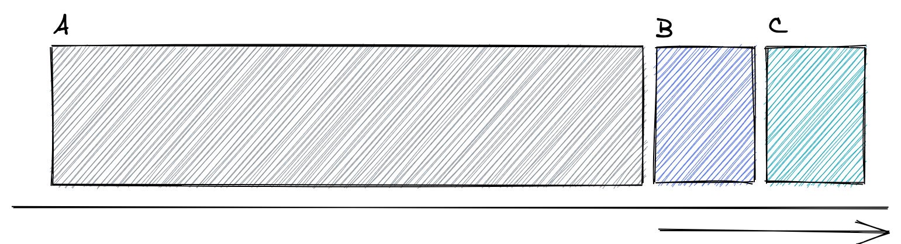
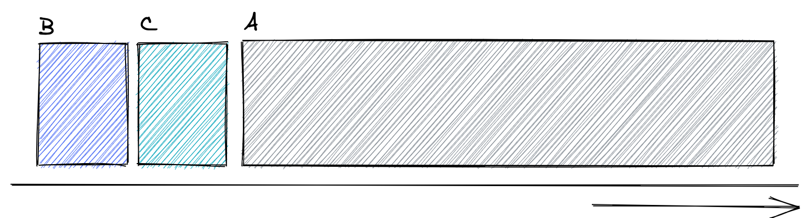
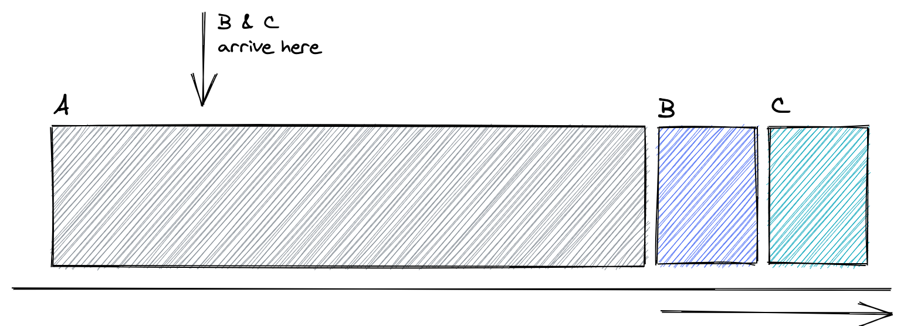
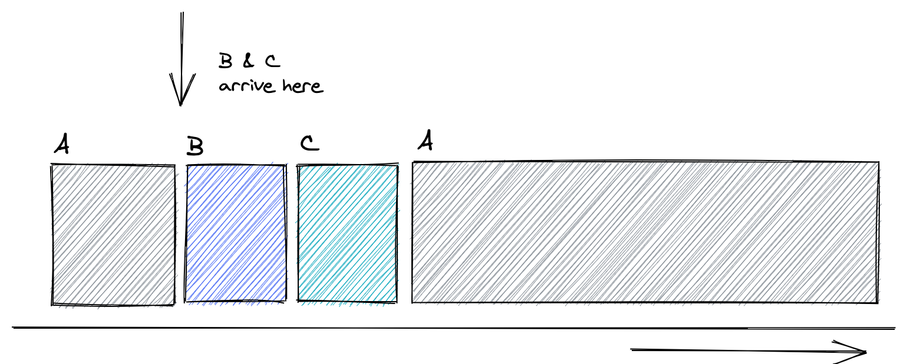
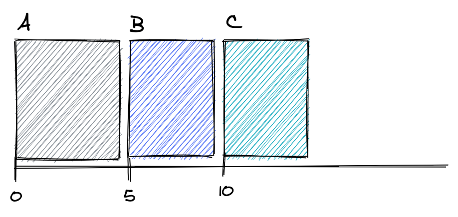
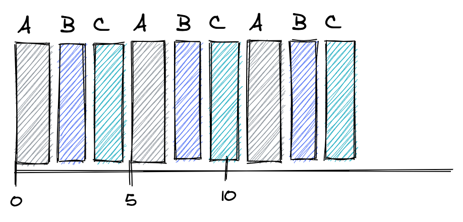
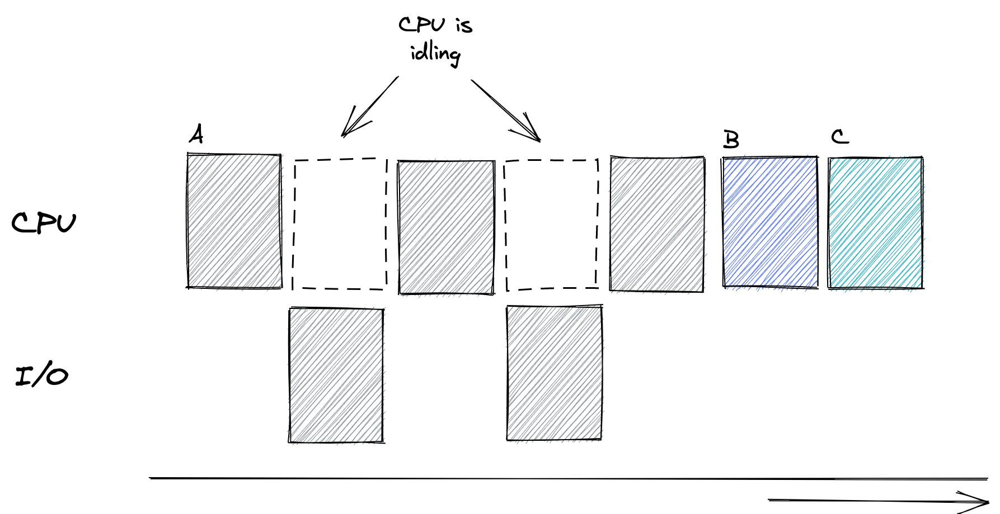
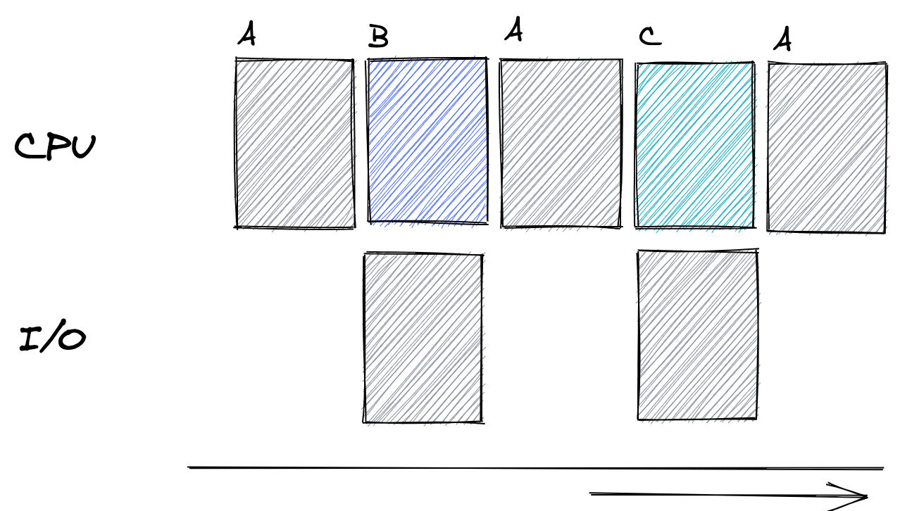

# Ch. 6: CPU Scheduling

What's the _best_ way of scheduling a series of running processes?

## The 'best' way?

Some metrics we can use to gauge how "good" our scheduler is:

- **Turnaround time** — Difference between completion time and arrival time.
- **Fairness** — Was the CPU divided evenly among the processes? Were there processes that use the CPU more than others?

These two metrics are usually at odds with each other; improving turnaround time typically comes at the cost of "fairly" dividing up the processes.

> Throughout all this, we're assuming the OS knows how long each process is going to run for.

## FIFO

FIFO (First-in, first-out) gives the CPU to the first process that arrives.

- Simple to implement and works fine for processes that are approx. equal in length.
- Processes are never really equal in length though. If the first process runs for a long time, there might be a 'convoy effect'; that long-running process blocks the other processes from running.

Here, process A has to run to completion before process B or C can start even though process A takes a long time.

## Shortest Job First (SJF)

Order the processes so that the one that takes the least amount of time gets to run first. In this method, B and C runs before A because A takes the longest out of the 3 processes:

But what if these processes don't _arrive_ at the same time?

If A arrives first, then B and C sometime later, the convoy effect's still going to happen:

## Shortest Time-to-Completion First (STCF)

So what if processes _don't_ have to run all the way through? This time, we'll run process A until B and C arrive. Then, we compare the _remaining time of A_ with the run time of B and C and schedule whatever's done first:

## Response Time

STCF is good when we only have to worry about turnaround time, but when we think about _response time_, STCF can perform quite poorly.

Here, we have 3 processes with the same run time:

With STCF, B has a response time of 5, and C has a response time of 10 — not good!

- Think about a terminal. When we input a command, we don't want to wait 10s before the process starts!

## Round Robin

Round-Robin scheduling is a way to minimize response time. It works by running a process for some short amount of time then switching to the next process. This happens until all processes finish.

This comes at the cost of turnaround time — processes start earlier, but finish later as well.

## I/O

What if processes are waiting for I/O, e.g., a network call, a memory read, a keyboard input? If we use our approach from before, we would have times where the CPU isn't doing anything:

Instead, we should consider process A to be 'done' when it makes the I/O call. When I/O finishes, we should treat the next bit of A as a new process that's waiting to be scheduled. This way, we can run other processes while waiting:

## Omniscient

In reality though, the OS can't possibly know how long an incoming process is going to run for. So how can our scheduler account for that?
